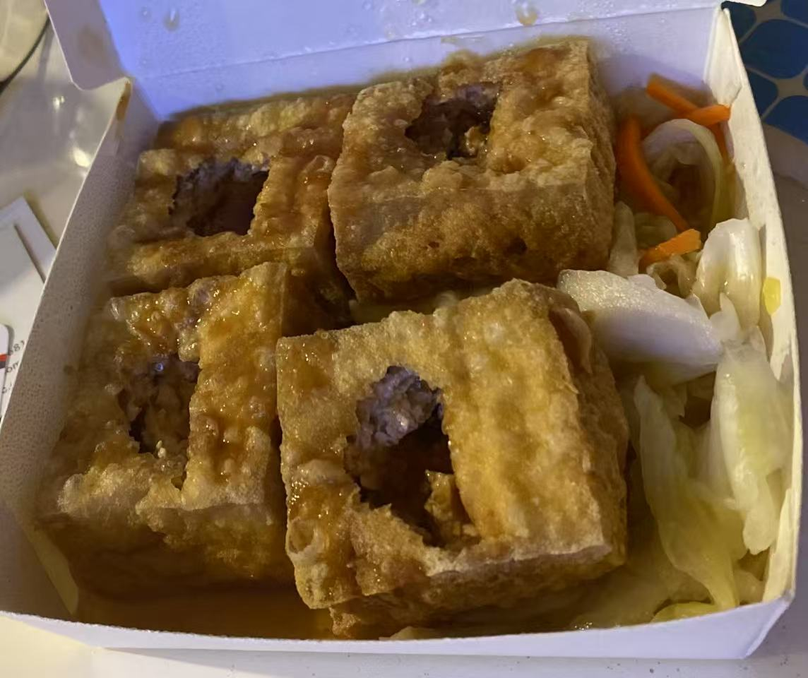
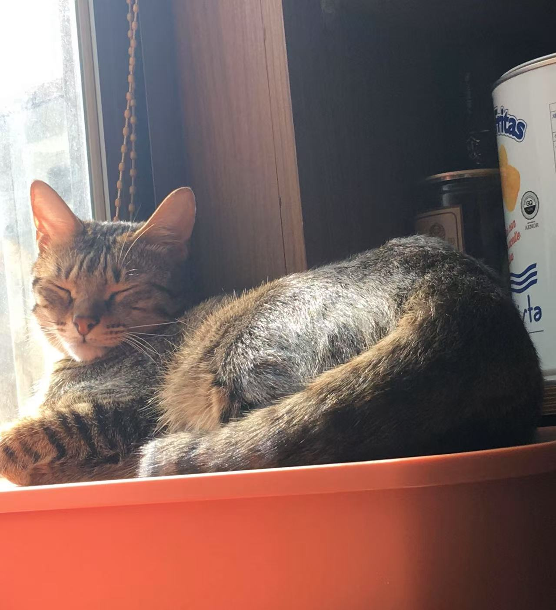

# Emily Liu's GitHub User Page


## About Me
Hi! I'm a junior CS student, transferred from San Diego Miramar College. I'm trying to learn everything but not a pro of anything.  


I'm from Taiwan, this is my favorite food -- stinky tofu.  
It smells bad but it tastes so good!  
The photo below is the stinky tofu near by my house. It's a really small shop but it's the best stinky tofu I've ever had. 



My favoraite flaver is macha, I like all the dessert in macha.  
I also named my cat as macha, but she's in Taiwan. I miss her so much😭.  

  
<br><br>

I'm currently want a Dyson Airwrap so bad, but it's too expendsive and doesn't have any discound right now, so I'm waiting for a discount and buy it.  
Here's a link for the Dyson Airwrap, the new pueple color looks so amazing. Hope someone will like it too. [Dyson Airwrap](https://www.dyson.com/hair-care/hair-stylers?ef_id=Cj0KCQjw782_BhDjARIsABTv_JC5BBlVGZA6RUzfAEu55kfOuDB1ngHAyCdYMRWxs1GDFn5fbBvNe4oaAm9SEALw_wcB:G:s&utm_id=sa_71700000120055079_58700008792821043&utm_source=google&utm_medium=cpc&utm_campaign=hc_airwrap-multi-styler_always-on&utm_content=do_text&utm_term=dyson+airwrap&gad_source=1&gclid=Cj0KCQjw782_BhDjARIsABTv_JC5BBlVGZA6RUzfAEu55kfOuDB1ngHAyCdYMRWxs1GDFn5fbBvNe4oaAm9SEALw_wcB&gclsrc=aw.ds)  

### Hobbt
- sleeping  
- baking
- kniting

### Most things I want to do
1. Go back to Taiwan
2. By a Dyson Air wrap 
3. Make lots of bread  

### Goal for his quarter
- [x] Keep alive
- [ ] Go to gym once a week
- [ ] Make bread once a week 

## Quote I like
> "Lazy is Not Shamful." -- from me.
cuz im lazy 

## My Style Test

This is **bold**  
This is *italic*  
This is ~~crossed out~~  
This is `inline code`  
This text is **bold and _italic_**  
***This is all bold and italic***  
This is a <sub>subscript</sub> text  
This is a <sup>superscript</sup> text  
This is an <ins>underlined</ins> text  
The background color is `#ffffff` for light mode and `#000000` for dark mode. 

## My Quote Code
```c
#include <stdio.h>

int main() {
    printf("Hello, stinky tofu!\n");
    return 0;
}
```

## Section Links

Check out [My info](#about-me) again!

## Relative Links
[Click to see stinky tofu](images/StinkyTofu.jpg)  
